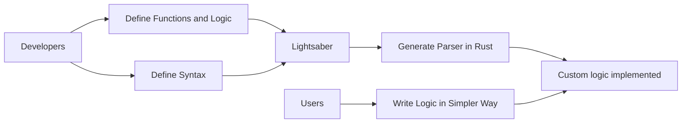

## Lightsaber proposal

#### Design Target

This project can be used as a Rust library, allowing developers to define their own scripting languages and integrate them into their projects. This includes defining the syntax and using Rust code to establish the logic.

By integrating this library, developers can define specific functions, structures, and interfaces, along with a simple syntax for their custom language. The end result is a simple language interpreter that can be provided to other users. The unique syntax and behavior of this custom language are defined by the developers themselves, using the Rust language.



#### Ideas

There are already some mature parser generators such as ANTLR. However, using ANTLR requires developers to have substantial relevant experience. Our project does not use the BNF method to define syntax, but instead provides a selection of common templates for developers to choose from. Additionally, we generate an interpreter, so users don't need to write code to traverse the AST.

Integrating the code we generate into downstream projects is similar to adding Lua script support in Nginx. However, the difference is that you can freely define your own language according to your preferences and needs, not just limited to using existing languages such as Lua, Javascript, etc.

#### Example

##### Var declaration

```yaml
lightsaber:
  var_decl:
    style: var # Choose var, let or none here
```

```javascript
var a = 1;
let b = 1;
c = 1;
```

##### Var declaration

```yaml
lightsaber:
  ident:
    style: ident # Choose ident, block, begin-end here
```

```javascript
// ident
if flag:
    print "Hello"

// block
if (flag) {
    print "Hello"
}

// begin-end
if flag begin
    print "Hello"
end
```
